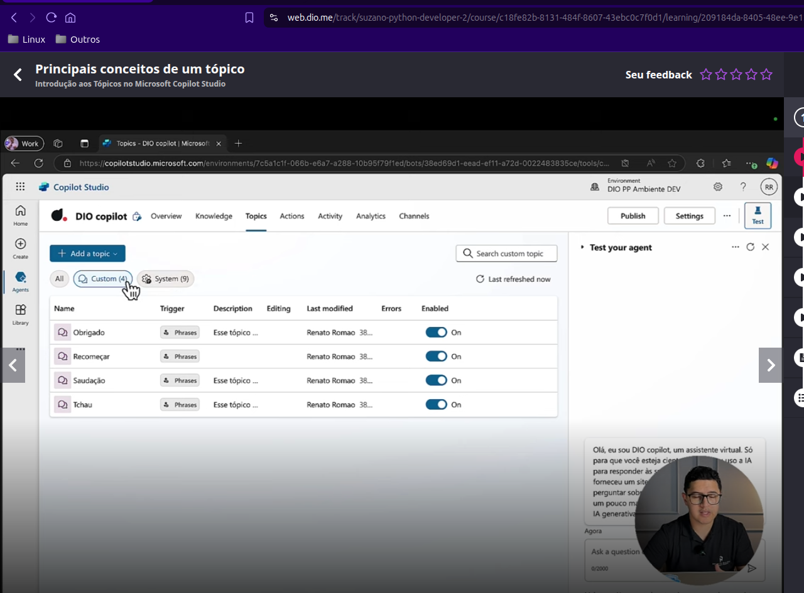
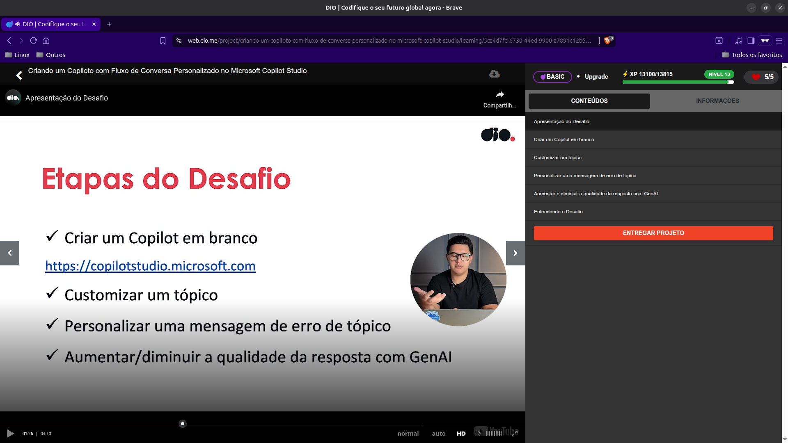

# Microsoft Copilot Studio

## Resumo

No curso que nos dá base para o desafio nós nos aprofundamos no processo de criação de copilotos.

Gostaria de ressaltar que existe a possibilidade de se usar YAML para personalizar os agentes:

- isto tornaria possível o uso de CaC (copiloto como código) ou TaC (tópico como código):
  - com isto poderíamos usar versionamento do código, avaliação e aprovação de patches por humanos, etc.

O fato do instrutor alertar MUIIITAS vezes que a parte generativa do Microsoft Copilot "precisa" ser configurada em
"contêineres" (o novo tópico) em Inglês sugere que o produto não é de interesse para empresas no Brasil. Ao menos, que
as empresas precisam ser muito cautelosas ao investir seriamente na plataforma. Pelo menos por enquanto.

### Conceitos relacionados a "tópico" relevantes para o desafio

- apesar dos avanços da IA generativa, os tópicos ainda são muito importantes na resolução de problemas de agentes de
  atendimento:
  - necessidade de projetar os tópicos:
    - projetar e organizar os tópicos de forma a maximizar a eficiência do agente;
    - existem boas práticas para se desenvolver tópicos. Devemos usá-las.
- no futuro, com avanço da IA, os tópicos devem ser menos importantes e/ou menos utilizados;
- podemos usar tópicos e migrar para IA generativa caso nossa estrutura em tópicos não seja capaz de lidar com a
  interação com o usuário.
- entidades ajudam a lidar com entradas feitas pelos usuários;
  - embora IA generativa consiga detectar e facilitar a entrada de dados, o uso de entidades ainda é útil e ajuda
    bastante, inclusive para reduzir o custo de computacao da IA generativa, quando esta não for essencial.

Podemos usar _prompts_ dentro Copilot Studio para nos ajudar a criar o que precisamos. O Copilot Studio oferece acesso a
um copiloto de IA dentro da própria plataforma:

- existem modelos de _prompts_ feitos pela comunidade que podemos usar em nossos projetos;
- podemos sugerir _prompts_ de exemplo no Sample Solution Gallery para a Microsoft e ganhar badges ao fazer isto.

### Durante o Desafio

"As coisas" que são muito interessantes que sejam personalidadas:

- o tópico "Conversational boosting", que é acionado quando a IA é acionada na conversa;
- o tópico "Fallback" é acionado quando o tópico falha.

Ainda, é importante e interessante personalizar a mensagem de erro do tópico. Eventualmente, logando o status do
processamento para debug posterior.

### Outras Observações

- o uso da IA integrado a plataformas como `Power Apps` e `Microsoft Copilot Studio` PODE (no futuro, talvez)
  transformar a forma de se criar sistemas;
- as `Knowledge Sources` são fontes de dados ou base de conhecimento que a IA usa para gerar respostas;
- um prompt claro e bem definido que oriente a IA é necessário para que as respostas generativas funcionem corretamente.

### Conclusão

Existem vários conceitos importantes que são necessários para se usar a plataforma, contudo, o uso em si é muito simples
e não requer conhecimentos técnicos relevantes.

Notas:

- Ao tentar acessar [copilotstudio.com](copilotstudio.com) somos redirecionados para
  <https://www.microsoft.com/pt-br/microsoft-copilot/microsoft-copilot-studio>.

## Evidências

- Como podemos ver, usar a inteface é simple e intuitivo:

---

- O desafio em si é simples, basta usar a GUI:

