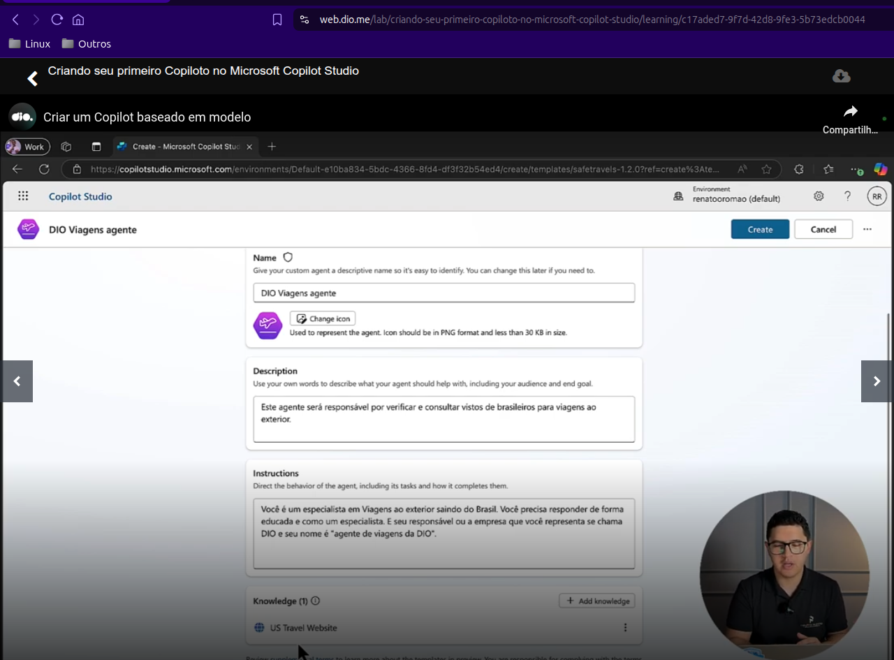
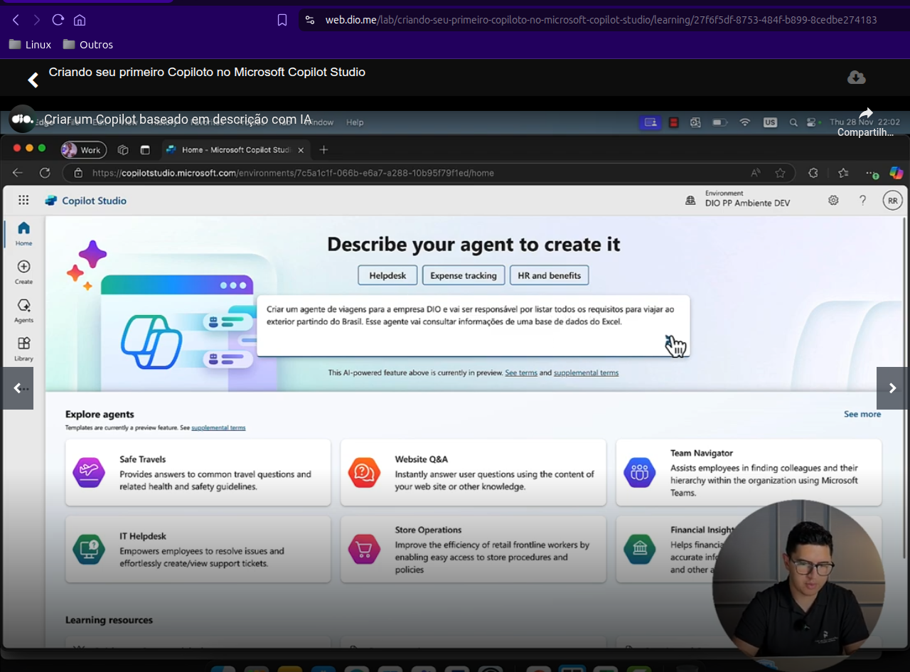

# Microsoft Copilot Studio

O Copilot Studio é uma plataforma de IA que permite criar agentes (de IA) usando linguagem natural por meio de uma
interface gráfica. Nela podemos projetar, testar e publicar agentes que atendam ás nossas necessidades para diferentes
cenários. Os agentes conseguem atender clientes internos ou externos à organização.

Este agentes respondem perguntas ou executem tarefas com base nas fontes de dados selecionadas por nós. Usando Microsoft
Copilot Studio podemos desenvolver e usar agentes que operam de forma independente para planejar, aprender e escalar
itens de trabalho para nós.

## Resumo

No curso aprendemos a criar copilotos:

- baseados em modelos pré-definidos criados pela Microsoft;
- ou criar modelos baseados em descrição para a IA, em que definimos via _prompt_ o que queremos e qual base de
  conhecimento a IA deve usar;
- ou criar modelos em branco, que basicamente funcionam da mesma forma que os modelo baseados em descrição para
  a IA listada acima.

Fomos informados que também é possível criar um agente baseado em chat, mas este parece ser um recurso que ainda está em
desenvolvimento e não aparece nas aulas.

No meu caso, para usar o copilot, preciso ter acesso a uma conta no Microsoft 365. Contudo, é sim possível criar
uma conta gratuíta no Microsoft 365.

Me pareceu adequado e interessante usar conta de inquilino (_tenant_) do Office 365 para TEST/DEV gratuito e usá-la para
explorar, testar e desenvolver soluções baseadas no Microsoft 365.

O instrutor ressaltou em várias oportunidades que usar o idioma inglês para criar os _prompts_ é importante e pode
melhorar a qualidade do resultado obtido, necessidade que não parece ser importante em outros ambientes de acordo com
usuários de outras plataformas de IA.

### Conclusão

Existem vários conceitos importantes que são necessários para se usar a plataforma, contudo, o uso em si é muito simples
e não requer conhecimentos técnicos relevantes.

Notas:

- Ao tentar acessar [copilotstudio.com](copilotstudio.com) somos redirecionados para
  <https://www.microsoft.com/pt-br/microsoft-copilot/microsoft-copilot-studio>.

## Evidências

- Como podemos ver, usar a inteface é simple e intuitivo:

****

- Criação de um agente via _prompt_:

