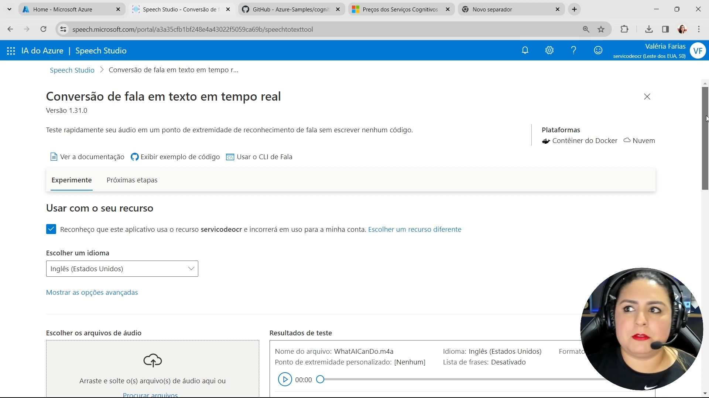

# Análise de Sentimento com IA

## Resumo

No curso que nos dá base para o desafio nós estudamos PLN com os serviços Azure.

No curso entendemos que a IA:

- compreende linguagem e é capaz de interagir com humanos;
- interpreta informações, inclusive, informações visuais;
- extrai informações e obtém conhecimento;
- é capaz de prever resultados e reconhece padrões com base em dados históricos;
- reconhece eventos e toma decisões.

Ainda, a importância de se usar IA de forma segura e responsável. Grande impacto da IA na vida de muitas pessoas.
Definimos que:

- um aplicativo copiloto está integrado a um aplicativo existente para ajudar a executar tarefas.

O Azure oferece vários serviços para ajudar o desenvolvimento de aplicação com IA

- Machine Learning: baseado em dados e estatística;
- Open AI: implantar, personalizar e hospedar modelos de LLMs;
- Visao computacional: capacidade de "ver" o mundo;
- Processamento de linguagem natural e tratamento de voz;
  - Inteligência de documentos: lidar com informações obtidas em grande quantidade de formulários e documentos;
  - Mineração de conhecimento: extrair informações em grande volume de dados, inclusive não estrurados.

Avanços interessantes:

- A IA generativa imita o comportamento humano, é capaz de criar conteúdo original em vários formatos

### Durante o Desafio

- Language Studio nos permite:
  - construir e criar modelos de ML personalizados para processamento de texto;
  - análise semantica de texto e fala;
  - ainda, automatizar a mineração de sentimento em grande volume de texto.

### Conclusão

Existem vários conceitos importantes que são necessários para se usar a plataforma, contudo, o uso em si é muito simples
e não requer conhecimentos técnicos relevantes.

## Evidências

- Conversão de fala em texto:
  - com as duas funções aqui destacadas, nós podemos processar um conjunto grande de gravações, transcrevê-las e avaliar
    se cada uma das conversas transcorreu bem ou não:

---

- Análise de sentimento de um texto feito com IA:

