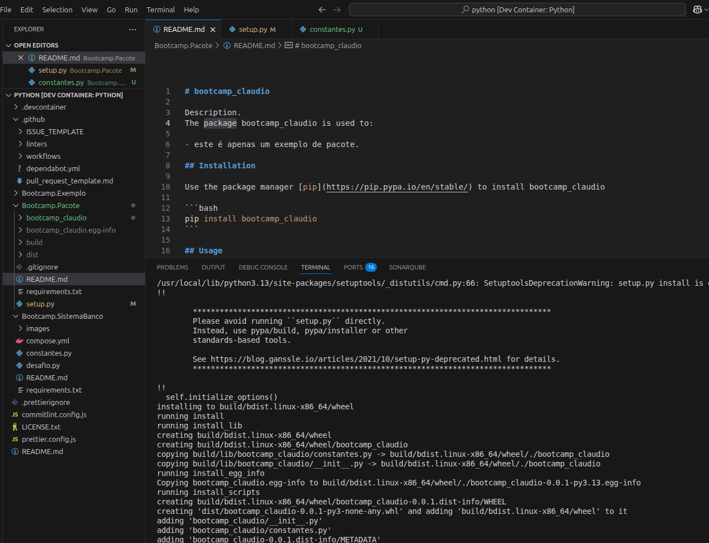

# bootcamp_claudio

Description.
The package bootcamp_claudio is used to:

- este é apenas um exemplo de pacote.

## Installation

Use the package manager [pip](https://pip.pypa.io/en/stable/) to install bootcamp_claudio

```bash
pip install bootcamp_claudio
```

## Usage

```python
from bootcamp_claudio import constantes
constantes.faz_nada()
```

## Author

Claudio André

## License

[GPL 2.0](https://choosealicense.com/licenses/gpl-2.0/)

## Evidências


