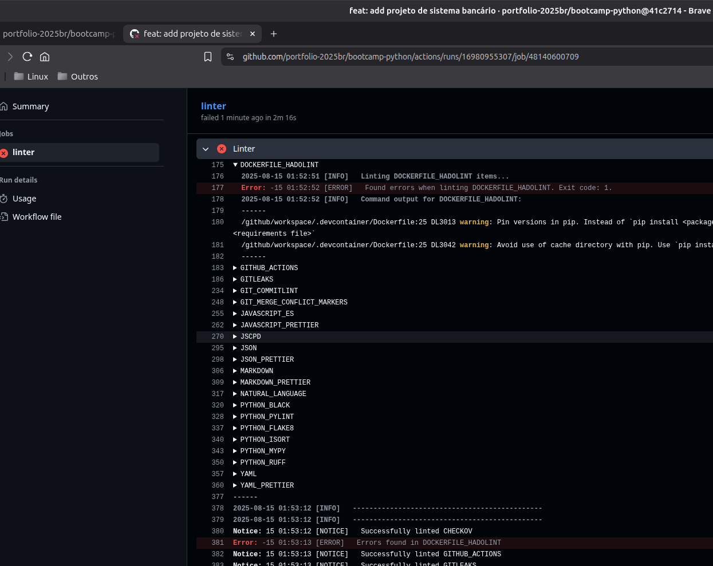
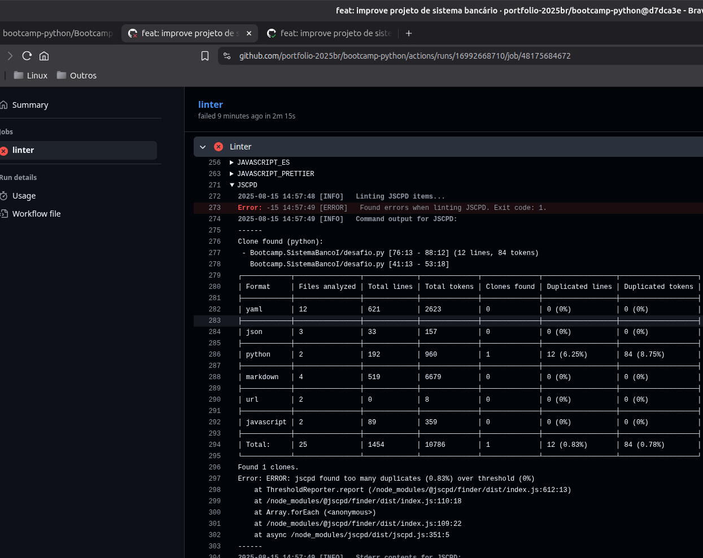
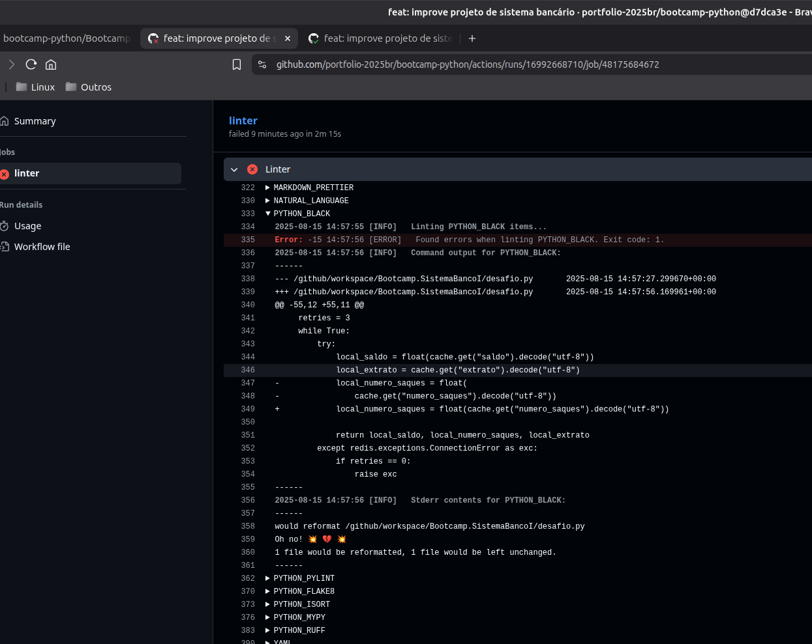
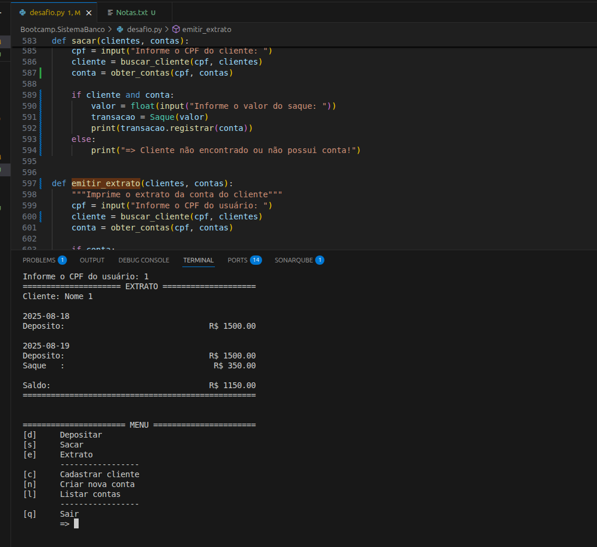
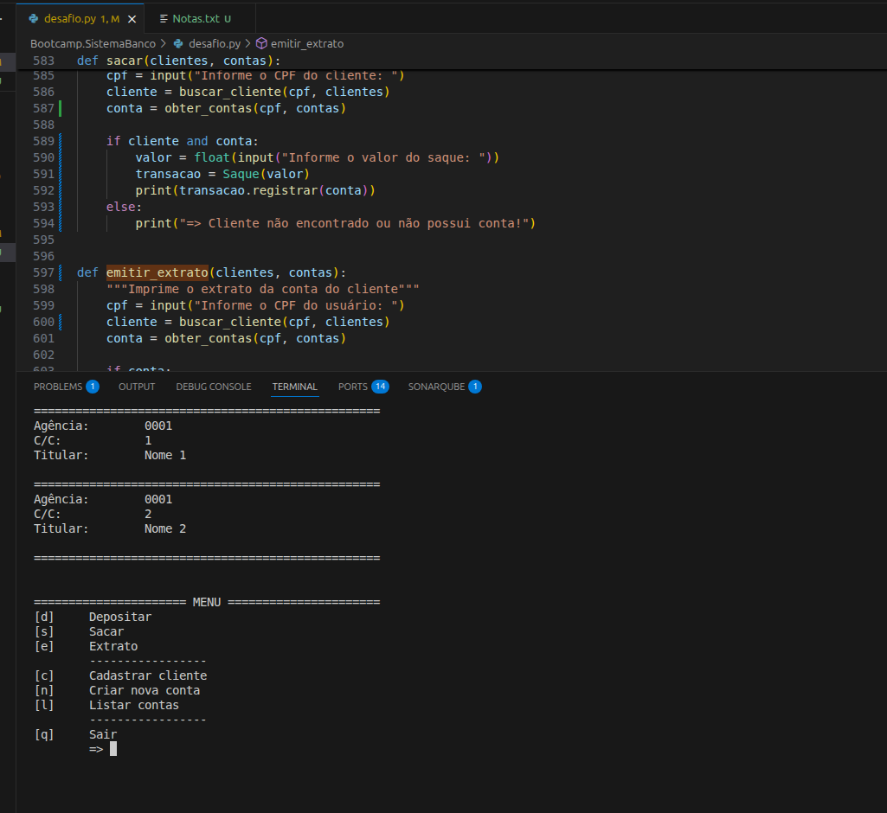
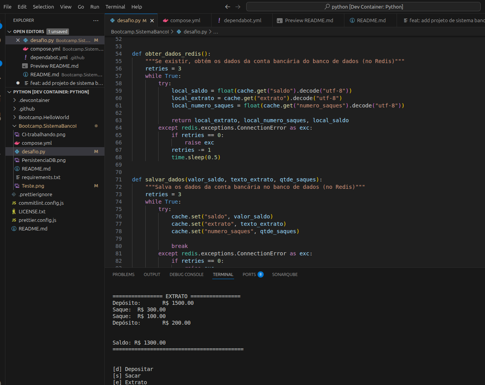
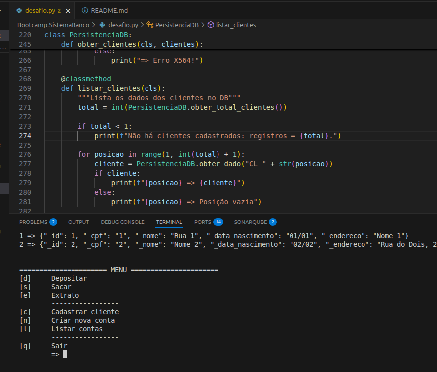

# DIO - Trilha Python - Sintaxe básica com Python

<https://www.dio.me/>

## Desafio de projeto

Para este desafio os participantes construirão um sistema completo, abordando funcionalidades como criação de contas,
transações e segurança. É uma oportunidade para aprimorar habilidades de programação Python e compreender conceitos
financeiros e de segurança.

## Contexto

Neste projeto eu utilizei Docker, Redis e Docker Compose para executar o desenvolvimento e testes da aplicação.

Para executar o aplicativo, basta executar:

```sh
$ docker compose up -d

# Se você estiver usando Dev Container, vai precisar conectar o container de desenvolvimento à rede usada pelo Redis.
$ docker network connect localNetwork <IDdevContainer>

```

## Solução

Pontos a destacar na minha solução:

- Uso de POO e encapsulamento conforme as convenções de Python [1];
- Experimentação e uso de Mixin;
- Persistênca com algum mecanismo de DB;
- Todo o desenvolvimento foi feito usando-se o Linux;
- Uso do Redis via Docker no Linux (nada foi instalado no host);
- Uso de rotinas de CI (integração contínua):
  - Uso do `prettier` para formatação e padronização de códigos;
  - Uso do `commitlint` para validação e padronização da mensagem de commit;
  - Uso de analisadores estáticos de código para verificar a qualidade do código;
- Uso do SonarQube localmente para verificar a qualidade do código e documentos do projeto;
- Uso de atualização automática de dependências com uso do Dependabot;
- Evidências de teste em <https://github.com/portfolio-2025br/bootcamp-python/tree/main/Bootcamp.SistemaBanco>.

[1] Eu iterei o processo de desenvolvimento até conseguir resolver todos os avisos do `pylint`:

```text
2025-08-19 05:12:04 [INFO]   Command output for PYTHON_PYLINT:
------

------------------------------------
Your code has been rated at 10.00/10
```

Ainda:

- A avaliação estática de código Python do CI funciona:
  - via CodeQL;
  - via super-linter com PYTHON_BLACK, PYTHON_PYLINT, PYTHON_FLAKE8, PYTHON_ISORT, PYTHON_MYPY e PYTHON_RUFF.
- Persistência de dados:
  - simulo um "banco de dados" (usando Redis) para manter os dados "salvos".
- Uso de Docker Compose (desnecessário nesta fase do projeto, eu não preciso "compor" nada).

### Integração Contínua em Ação

O CI funciona e adverte o time de desenvolivimento em caso de problemas.

- Sugestão para definir uma versão específica dos pacotes. Isto garante que problemas ou comprometimento do _upstream_
  não impactem automaticamente este projeto:



---

- Detecção de código fonte duplicado:



---

- Detecção de problemas na formatação do código fonte:



### Testes

- O sistema foi testado e seguem evidências dos testes:



---

- Listagem de Contas:



### Dados salvos em DB (Redis)

- Os dados permanecem salvos em um banco de dados mesmo após o encerramento da aplicação:



---

- Foram criadas rotinas de debug para listar os dados que estão salvos no banco de dados:


